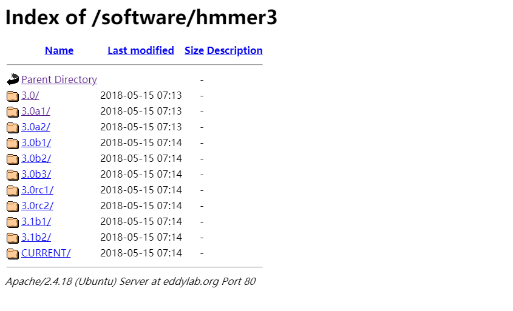
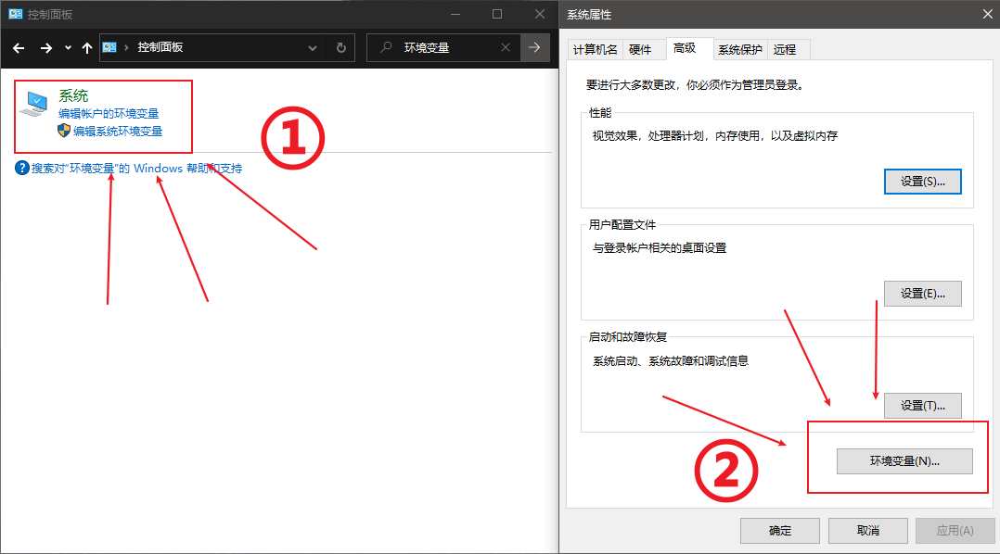
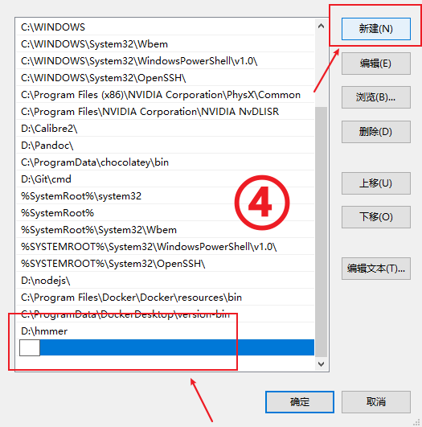
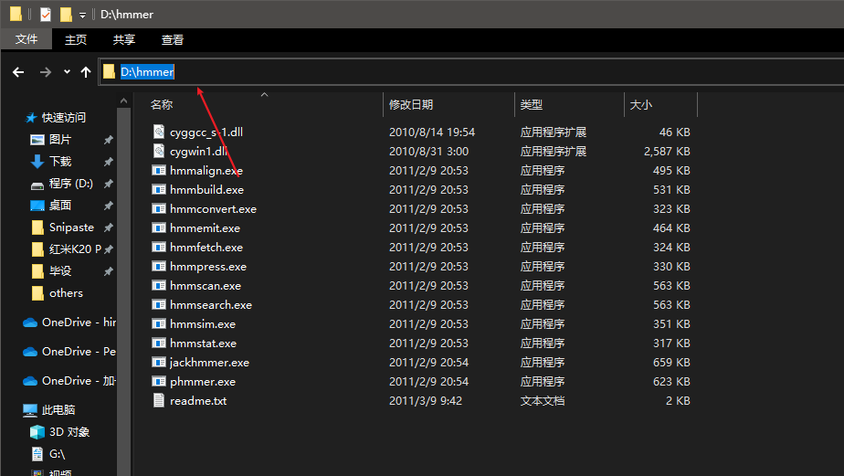
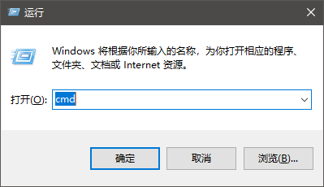
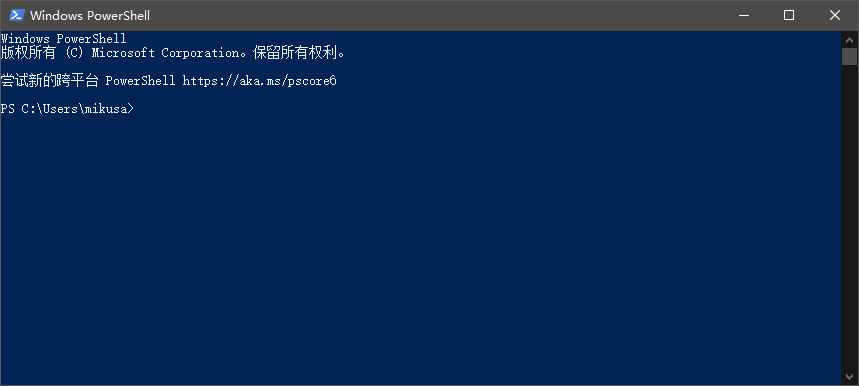
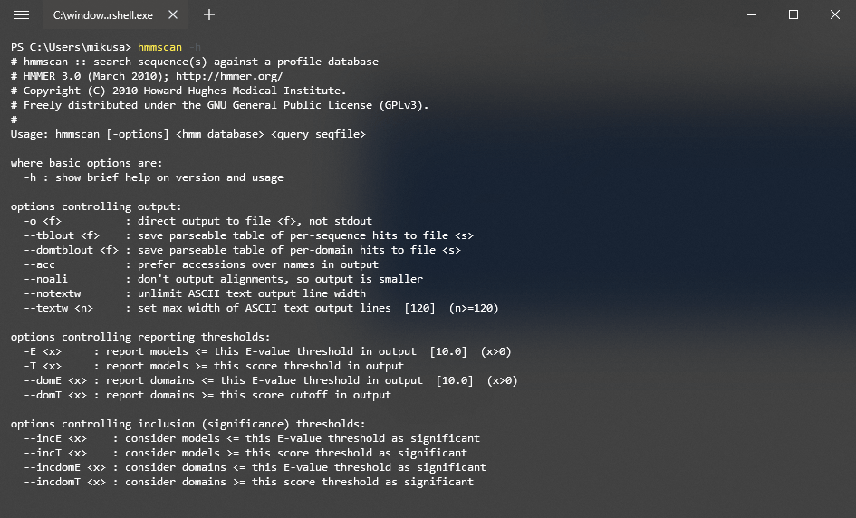

### 1. 下载

既然不能为了使用 Linux HMMER 特地开个虚拟机~~（好像也不是不行）~~，那就找找看历史版本。通过已知的 Linux 版下载链接，发现 HMMER 把所有的历史软件都放在[这个地方](http://eddylab.org/software/) 备份着，因此得知最后一个 Windows HMMER 版本为 3.0。[传送门](http://eddylab.org/software/hmmer3/3.0/hmmer-3.0-windows.zip)  / [备份](https://www.lanzous.com/iafa2sf)



下载、解压之后，是一堆看不懂的东西，没有可以直接双击打开的`.exe`文件，大概是需要敲命令才能启动程序。搜索了一下安装方法[^windows下安装hmmer软件进行结构域模式扫描：https://www.jianshu.com/p/5419a7569e10]，下面详细演示。

### 2. 安装

Windows HMMER 安装起来还算简单。

首先打开 **控制面板**，搜索 **环境变量**，点击 **编辑系统环境变量**，选择 **环境变量**




在 **系统变量** 里找到`Path`，点击 **编辑**


点击右边的 **新建** 按钮，填入 HMMER 所在的 **路径**



如果不知道啥叫路径，进入你放 HMMER 的地方，按照下图把地址栏里的东西复制下来，粘贴进上面的变量里，添加完成后，一路确定就行。



### 3. 测试

接下来 **测试** 看能不能用，需要用到可以输入命令的东西。常用的有 CMD 和 Windows PowerShell，二选一即可。

打开CMD：WINDOWS键 + R ，输入 `cmd`，点击确定打开**命令提示符**



打开Windows PowerShell：对着开始菜单 **右键**，选择`Windows PowerShell`



然后输入

```
hmmscan -h
```

建议直接复制粘贴，避免出错。如果出现类似下面的东西，就说明安装上了。

